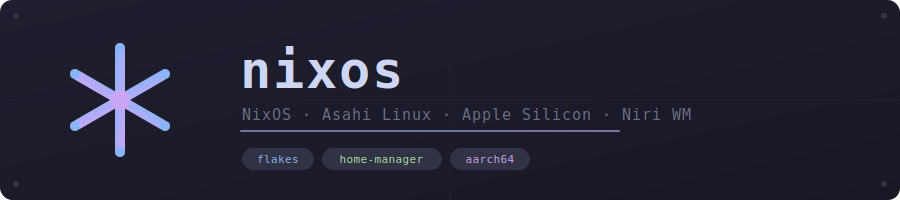
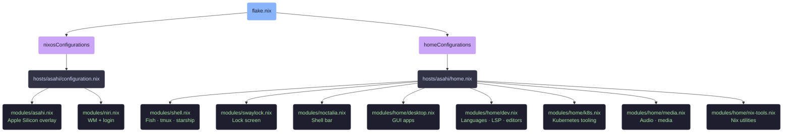

<div align="center">




</div>

NixOS configuration for an Apple Silicon MacBook running [Asahi Linux](https://asahilinux.org/), managed with [Nix Flakes](https://nixos.wiki/wiki/Flakes) and [Home Manager](https://github.com/nix-community/home-manager).

## System

| Component | |
|---|---|
| **Host** | `asahi` — MacBook Pro 14", M2 Pro, aarch64-linux |
| **Nixpkgs** | unstable channel |
| **Desktop** | [Niri](https://github.com/YaLTeR/niri) Wayland tiling compositor |
| **Shell / Bar** | Fish + [Noctalia](https://github.com/noctalia-dev/noctalia-shell) |
| **Terminals** | Alacritty (primary), Ghostty (secondary) |
| **Editor** | Neovim (full LSP) + Zed |
| **Font** | Berkeley Mono Nerd Font |
| **Theme** | Catppuccin Mocha throughout |

---

## Architecture



---

## Repository Structure

<details>
<summary>Expand file tree</summary>

```
├── flake.nix                  # Inputs and system/home outputs
├── hosts/
│   └── asahi/
│       ├── configuration.nix  # System-level NixOS config
│       ├── hardware-configuration.nix # Apple Silicon hardware
│       └── home.nix           # Home Manager entry point
├── modules/
│   ├── asahi.nix              # Apple Silicon overlay (system)
│   ├── niri.nix               # Niri WM, greetd/tuigreet login (system)
│   ├── shell.nix              # Fish, tmux, direnv, zoxide, starship (home)
│   ├── swaylock.nix           # Lock screen with blur/vignette (home)
│   ├── noctalia.nix           # Noctalia config symlinks (home)
│   └── home/
│       ├── desktop.nix        # Desktop apps and GUI tools (home)
│       ├── dev.nix            # Developer tools and languages (home)
│       ├── k8s.nix            # Kubernetes tooling (home)
│       ├── media.nix          # Media and audio packages (home)
│       └── nix-tools.nix      # Nix utilities and helpers (home)
├── config/
│   ├── niri/                  # Niri window manager config (KDL)
│   ├── nvim/                  # Neovim config (Lua)
│   ├── alacritty/             # Alacritty terminal config
│   ├── git/                   # Git config, templates, work overrides
│   └── noctalia/              # Noctalia shell settings and theme
├── scripts/
│   ├── tmux-sessionizer.fish  # FZF-based project switcher (Ctrl+F)
│   └── work-flake-bootstrap.sh # devShell generator for work projects
└── fonts/                     # Berkeley Mono Nerd Font TTF files
```

Config files under `config/` are managed as out-of-store symlinks via `xdg.configFile` in `home.nix`.

</details>

---

## Usage

<details>
<summary>Rebuild and validation commands</summary>

**System rebuild**
```bash
nh os switch --hostname asahi -- --impure
# Fish abbreviation: rebuild
```

**Home Manager rebuild**
```bash
home-manager switch -b backup --impure --flake /home/ruben/nixos#ruben
# Fish abbreviation: hrebuild
```

**Lint**
```bash
deadnix .
statix check .
```

**Build checks**
```bash
# System
nix flake check
nix build .#nixosConfigurations.asahi.config.system.build.toplevel

# Home
nix flake check
nix build .#homeConfigurations.ruben.activationPackage
```

</details>

---

## Notable Features

<details>
<summary>Expand</summary>

**Hardware & peripherals**
- Apple Silicon support via [nixos-apple-silicon](https://github.com/tpwrules/nixos-apple-silicon)
- DisplayLink dock (LG 4K, 3840×2160 @ 1.5× scale) alongside MacBook built-in (3024×1890 @ 2.0× scale)
- Sony WH-1000XM5 Bluetooth headset auto-connect with volume stabilization (Wireplumber)
- Virtual camera service: FaceTime HD (NV12) → MJPEG transcoding via ffmpeg for Chromium WebRTC

**Shell & workflow**
- Fish auto-attaches to a tmux session on terminal launch
- `Ctrl+F` opens `tmux-sessionizer`: FZF project picker across `~/repos`, `~/work`, `~/nixos`
- `work-flake-bootstrap`: generates a `flake.nix` + `.envrc` for work projects (mokum, centric, rodk, bigdatarepublic, muxyard)
- Tmux prefix `Ctrl+Space`, session auto-restore via resurrect + continuum

**Development**
- Languages: Go, Lua, Python 3.13, Rust, Zig
- Python tooling: uv, ruff, pyrefly, ty (JEMALLOC override for ARM)
- LSP servers: Bash, Docker, Lua, Emmet, VTSLS, YAML, Marksman, Taplo
- Kubernetes: kubectl (→ kubecolor), k9s, kubectx, helm, kustomize, kind, stern

**Identity & security**
- 1Password: SSH agent, git commit signing, CLI
- Git SSH signing with conditional work config (email override for `~/work/`)
- Git pager: delta

</details>
